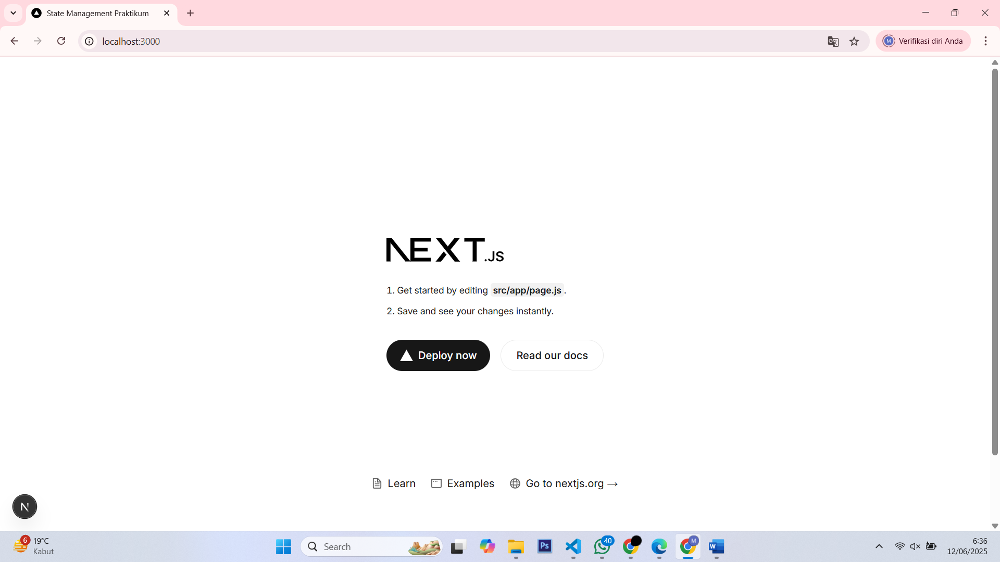
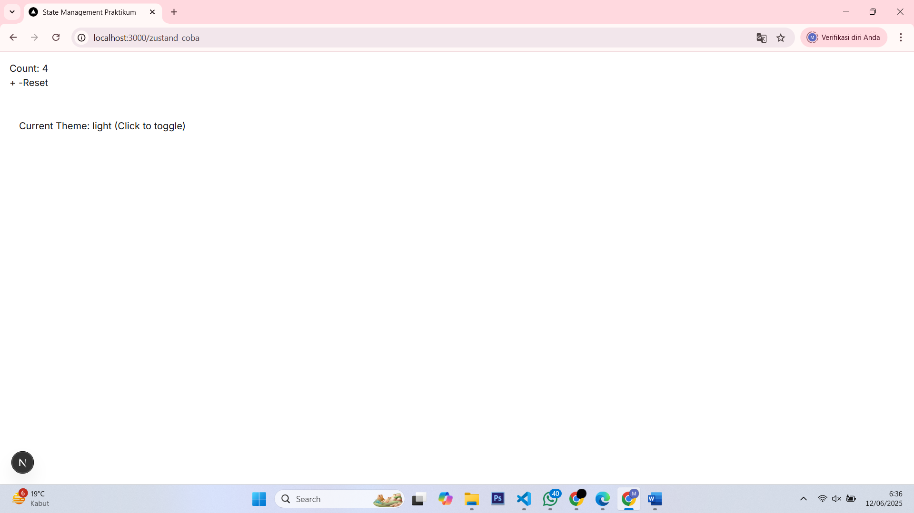
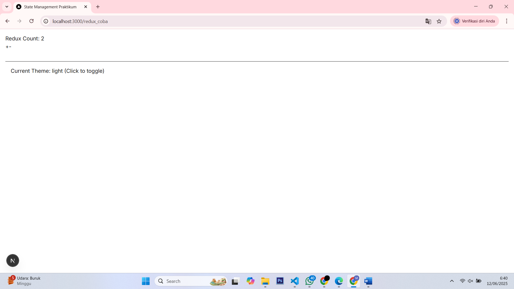
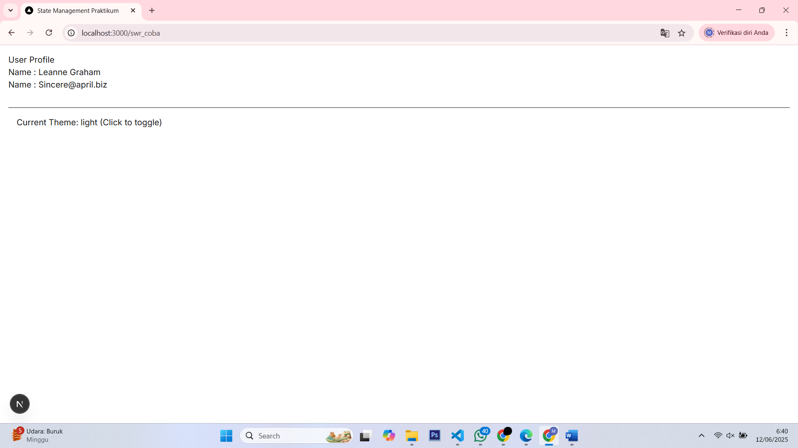
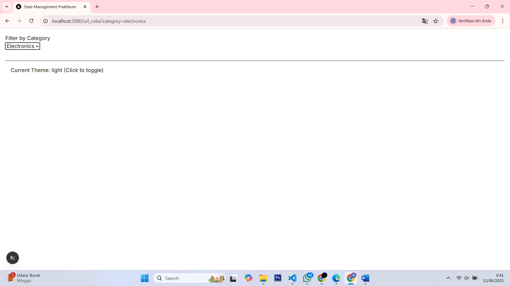

## Laporan Praktikum

|  | Pemrograman Berbasis Framework 2025 |
|--|--|
| NIM |  244107027015|
| Nama |  Muhamad Saifulloh Bahroin Gana Perkasa |
| Kelas | TI - 4K |

### Tugas

## Jawaban

## Praktikum 1: React Context untuk State Global Sederhana

## Praktikum 2: Zustand untuk State Management Kompleks

## Praktikum 3: Redux Toolkit dengan SSR Support

## Praktikum 4: Data Fetching dengan SWR

## Praktikum 5: URL State Management

